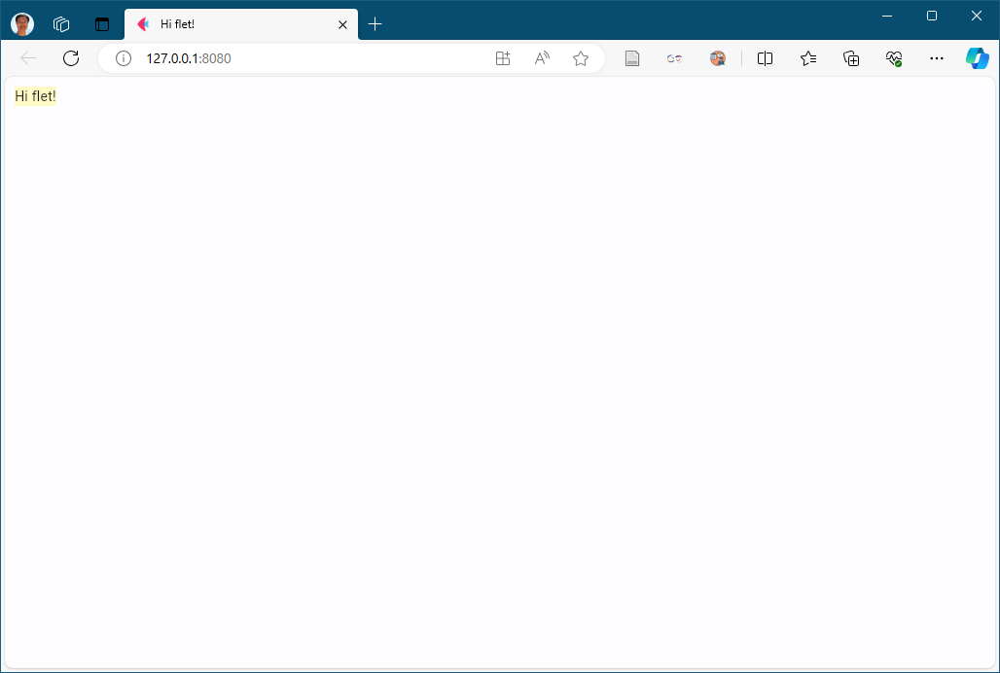
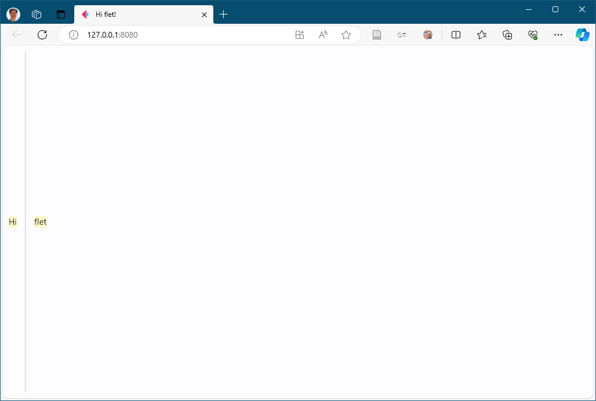
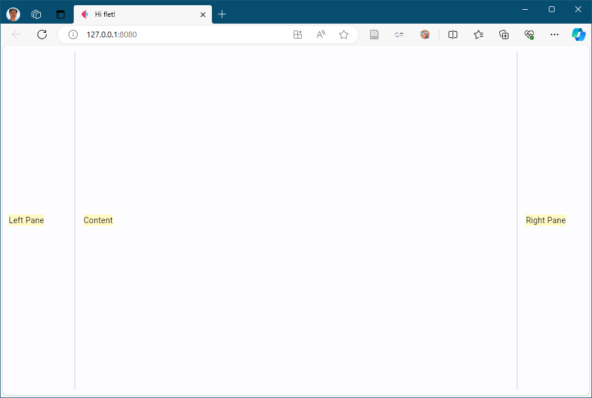
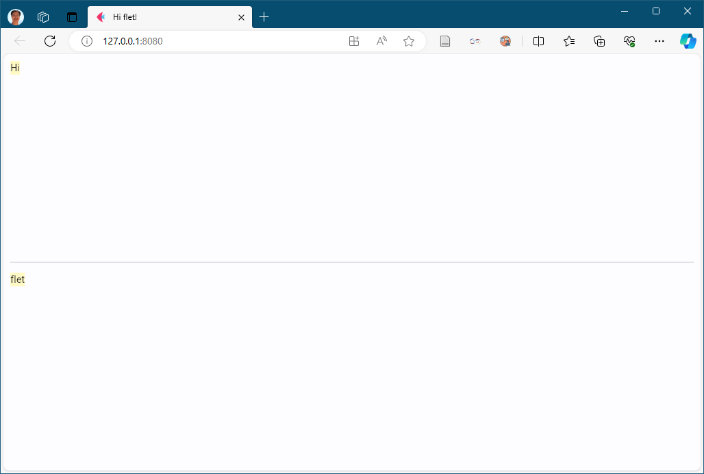
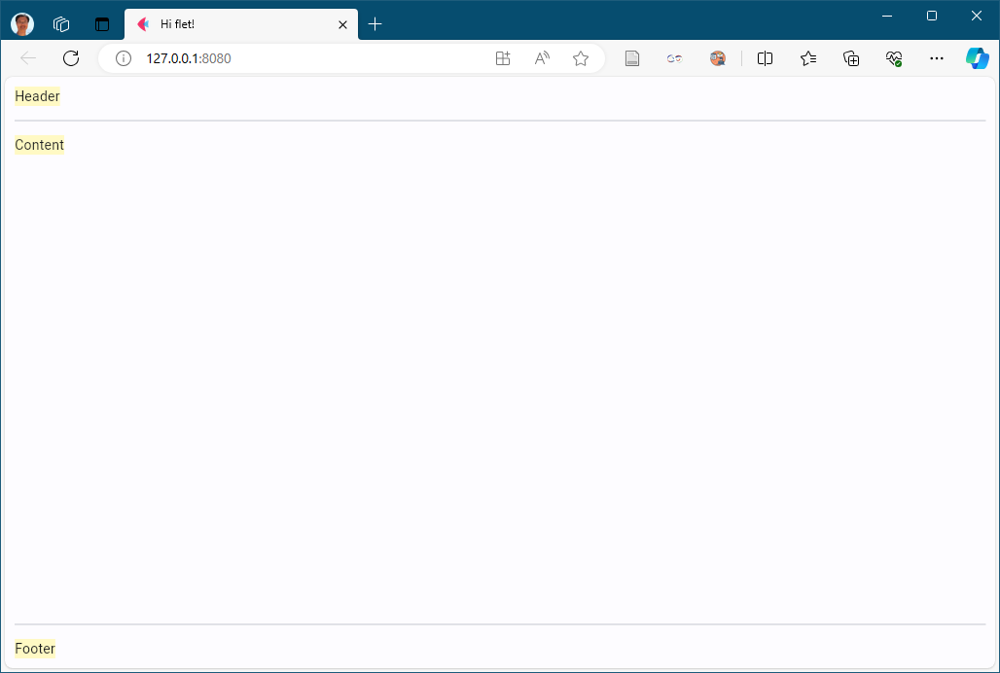
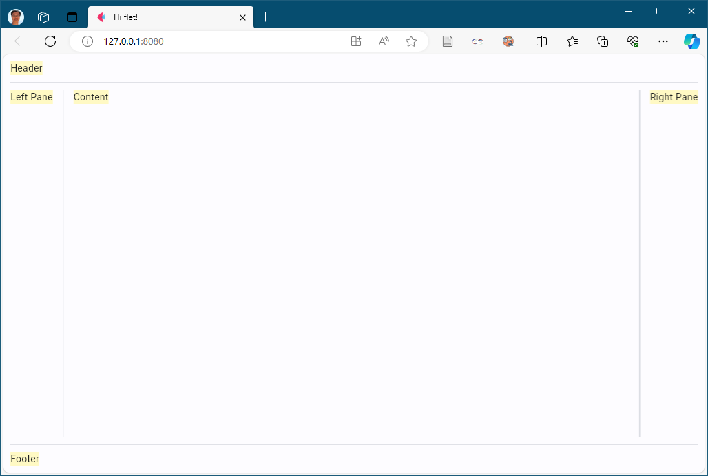
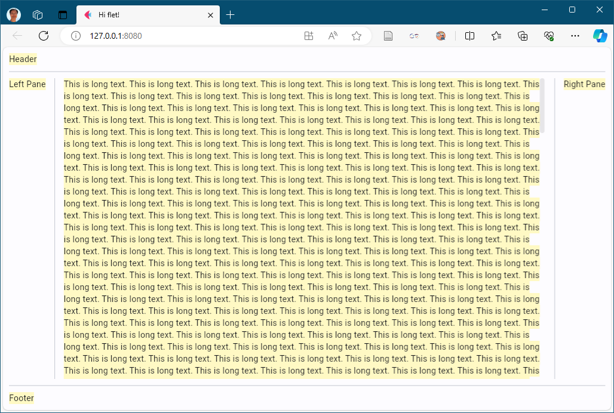

# Flet Layout Example

## layout_simple



```python
    await page.add_async(
        ft.Text('Hi flet!', bgcolor=ft.colors.YELLOW_100)
    )
```

## layout_row_compact



```python
    await page.add_async(
        ft.Row([
            ft.Text('Hi', bgcolor=ft.colors.YELLOW_100),
            ft.VerticalDivider(width=10),
            ft.Text('flet', bgcolor=ft.colors.YELLOW_100),
        ], expand=True)
    )
```

## layout_row_expand


```python
    await page.add_async(
        ft.Row([
            ft.Text('Hi', bgcolor=ft.colors.YELLOW_100, expand=True),
            ft.VerticalDivider(width=10),
            ft.Text('flet', bgcolor=ft.colors.YELLOW_100, expand=True),
        ], expand=True)
    )
```

## layout_row_3_area



```python
    await page.add_async(
        ft.Row([
            ft.Text('Left Pane', bgcolor=ft.colors.YELLOW_100, width=100),
            ft.VerticalDivider(width=10),
            ft.Text('Content', bgcolor=ft.colors.YELLOW_100, expand=True),
            ft.VerticalDivider(width=10),
            ft.Text('Right Pane', bgcolor=ft.colors.YELLOW_100, width=100),
        ], expand=True)
    )
```

## layout_col_compact


```python
    await page.add_async(
        ft.Column([
            ft.Text('Hi', bgcolor=ft.colors.YELLOW_100),
            ft.Divider(height=10),
            ft.Text('flet', bgcolor=ft.colors.YELLOW_100),
        ])
    )
```

## layout_col_expand



```python
    await page.add_async(
        ft.Column([
            ft.Text('Hi', bgcolor=ft.colors.YELLOW_100, expand=True),
            ft.Divider(height=10),
            ft.Text('flet', bgcolor=ft.colors.YELLOW_100, expand=True),
        ], expand=True))
```

## layout_col_bottom


```python
    await page.add_async(
        ft.Column([
            ft.Text('Hi', bgcolor=ft.colors.YELLOW_100, expand=True),
            ft.Divider(height=10),
            ft.Text('flet', bgcolor=ft.colors.YELLOW_100),
        ], expand=True))
```

## layout_col_3_area



```python
    await page.add_async(
        ft.Column([
            ft.Text('Header', bgcolor=ft.colors.YELLOW_100),
            ft.Divider(height=10),
            ft.Text('Content', bgcolor=ft.colors.YELLOW_100, expand=True),
            ft.Divider(height=10),
            ft.Text('Footer', bgcolor=ft.colors.YELLOW_100),
        ], expand=True))
```

## layout_3x3



```python
    await page.add_async(
        ft.Column([
            ft.Text('Header', bgcolor=ft.colors.YELLOW_100),
            ft.Divider(height=2),
            ft.Row([
                ft.Text('Left Pane', bgcolor=ft.colors.YELLOW_100),
                ft.VerticalDivider(width=10),
                ft.Text('Content', bgcolor=ft.colors.YELLOW_100, expand=True),
                ft.VerticalDivider(width=10),
                ft.Text('Right Pane', bgcolor=ft.colors.YELLOW_100),
            ],
                expand=True,
                vertical_alignment=ft.CrossAxisAlignment.START
            ),
            ft.Divider(height=2),
            ft.Text('Footer', bgcolor=ft.colors.YELLOW_100),
        ], expand=True))
```

## layout_3x3_scroll



```python
    long_text = 'This is long text. ' * 1000

    await page.add_async(
        ft.Column([
            ft.Text('Header', bgcolor=ft.colors.YELLOW_100),
            ft.Divider(height=2),
            ft.Row([
                ft.Text('Left Pane', bgcolor=ft.colors.YELLOW_100),
                ft.VerticalDivider(width=10),
                ft.Column([ft.Text(long_text, bgcolor=ft.colors.YELLOW_100)],
                          expand=True,
                          scroll=ft.ScrollMode.ALWAYS),
                ft.VerticalDivider(width=10),
                ft.Text('Right Pane', bgcolor=ft.colors.YELLOW_100),
            ],
                expand=True,
                vertical_alignment=ft.CrossAxisAlignment.START
            ),
            ft.Divider(height=2),
            ft.Text('Footer', bgcolor=ft.colors.YELLOW_100),
        ], expand=True))
```
